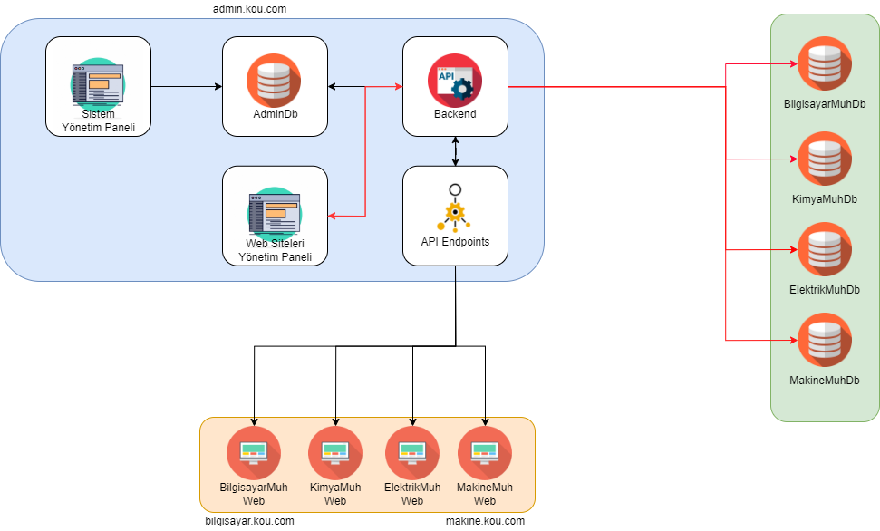
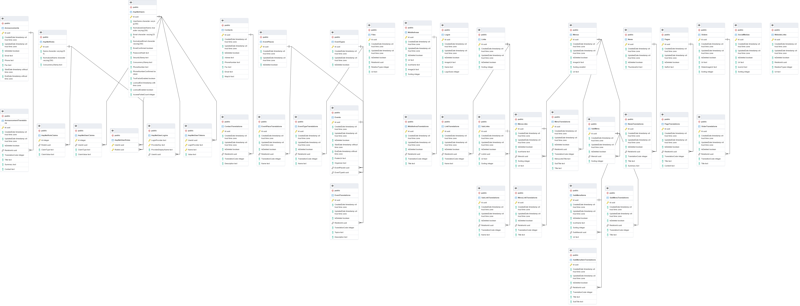

# Kocaeli Üniversitesi - Web Pages 

## Architecture

## Descriptions

* Kocaeli University Project is a set of modular systems that allow the web pages of all departments and departments of the university’s faculties
to be managed through a single API.
* During the development of this application, .Net Core API with layered architecture was studied in accordance with SOLID principles.
* In project scope; API, admin panel and website were made. Technologies used to develop:
* RESTful API was developed with Asp .Net Core.
* PostgreSQL was used for the database.
* Next js was used for admin panel and websites.
* Projects were hosted on VDS during development.
* Developed in accordance with Devops and CI/CD processes.
* Github and Git Version Control system were used. Releases were managed using Semantic versioning.

## Database UML

## Sample Website

You can view the sample website by following the link (http://mezun.kocaeli.edu.tr/).

## Project Code Examples

You can navigate by following the links.

### Backend

[Folder Structure](./md/folder-structure.md)

[Sample Controller](./md/controller.md)

## Authors

* **Cemre Can Kaya** - [GitHub](https://github.com/cemrecankaya)
* **Engin Yenice** - [GitHub](https://github.com/enginyenice)
* **Ramazan Kaan Yarayan** - [GitHub](https://github.com/rknyryn)
